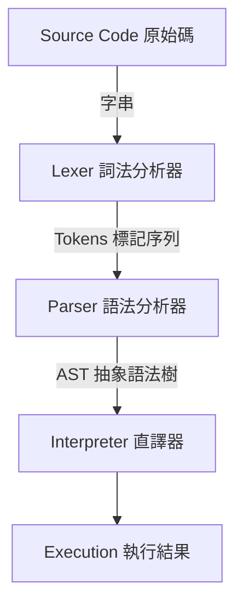

# C++ Lox Interpreter

這是一個以 C++ 實作的 Lox 語言直譯器專案。本專案將原始碼字串經過詞法分析與語法分析後，轉換為抽象語法樹 (AST)，最後由直譯器進行執行。

## 專案架構圖

以下是本專案的核心編譯與執行流程架構：



## 核心元件介紹

* **主要進入點 (main.cpp)**：定義了 `Lox` 類別，為整個直譯器的控制中心。它負責提供讀取檔案執行 (`runFile`) 以及互動模式 (`runPrompt`) 的功能，並協調處理錯誤回報機制。
* **詞法分析器 (Lexer)**：負責將輸入的原始碼字串掃描並轉換為 `Token` 序列。此模組能夠處理包含字串、數字、識別字等型別，並內建關鍵字字典以區分保留字與一般變數名稱。
* **語法分析器 (Parser)**：接收 `Lexer` 產生的 `Token` 序列，並將其解析為多個陳述式 (`Stmt`) 組成的列表。目前支援的解析規則包含：變數宣告、區塊陳述式、印出陳述式、一般表達式陳述式、賦值、等號與比較運算、一元運算等。它同時也具備處理語法錯誤 (`ParseError`) 與同步復原 (`synchronize`) 的能力。
* **直譯器 (Interpreter)**：接收 `Parser` 成功解析後的陳述式列表，並實際執行這些邏輯。

## 執行方式

編譯完成後，執行檔名稱預設為 `cpplox`。本直譯器支援兩種執行模式：

1. **檔案模式**：讀取並執行指定的腳本檔案。
```bash
./cpplox [script]

```


2. **互動模式 (REPL)**：若未提供任何檔案路徑，將進入互動式的提示字元模式，可逐行輸入並執行程式碼。
```bash
./cpplox
>
```
